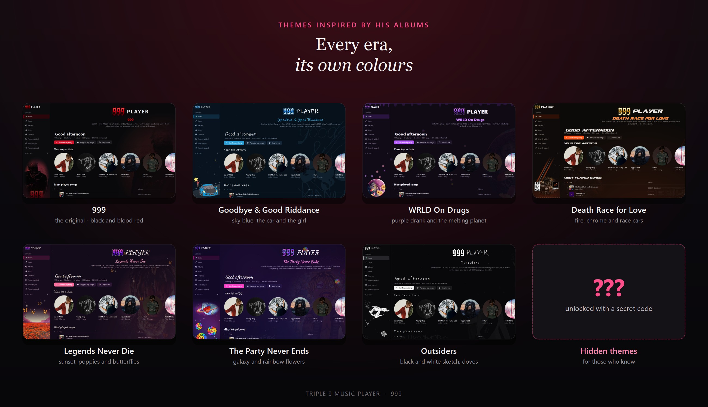
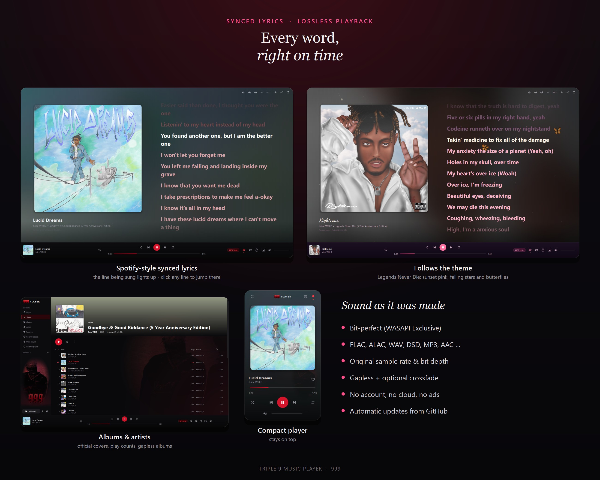

<div align="center">


# Triple 9 Music Player

**A lossless music player for Windows, made as a tribute to Juice WRLD.**

Bit-perfect playback · synced lyrics · a fast library · themes inspired by his albums

[**⬇ Download the latest version**](https://github.com/imtatar999/triple-9-music-player/releases/latest/download/Triple9MusicPlayer-Setup.exe)

</div>

<p align="center"></p>
<p align="center"></p>

---

## 999

This player is a tribute to **Juice WRLD** (Jarad Anthony Higgins, 1998 – 2019) and the music he left us.

**999** was his symbol. He described it as **666 turned upside down**: taking whatever you go through -
pain, struggle, the bad days - and turning it into something positive that pushes you forward.
His first EP, *999*, was released on SoundCloud in 2017, and the number stayed with him on his records,
his merch and his arm. Every theme in this player starts from that idea, and the 999 logo is in the
corner of every one of them.

*Long live Juice WRLD. 999 forever.*

## Features

**Sound**
- Every format FFmpeg can read: FLAC, ALAC, WAV, AIFF, APE, WavPack, DSD, MP3, AAC, Ogg, Opus, WMA …
- Files go to the sound card **at their own sample rate and bit depth** - nothing is resampled or dithered
- **WASAPI Exclusive** mode for **bit-perfect** playback (shown in the player bar when it really is)
- Gapless playback, exact seeking, optional crossfade (1 - 12 s)
- *System default* output follows Windows: switch your speakers / headphones there and the music moves with it

**Lyrics**
- Spotify-style **synced lyrics** next to the cover; click a line to jump there
- Word-by-word highlighting for enhanced LRC, adjustable timing, text size and colours
- Finds lyrics embedded in the file, in `.lrc` files or in `.txt` files (order is configurable)

**Library**
- **Home** page with your top artists, most played songs, albums on repeat and more
- Songs, Albums, Artists, Favorites, Recently added, Most played (with a play counter), Recently played
- Playlists with drag-and-drop ordering, `.m3u` import / export
- Official album covers (MusicBrainz / Cover Art Archive) and artist pictures (Deezer) - or set your own
- Starts in under a second with a big library; only new or changed files are read again

**Look**
- Themes inspired by his albums: **999**, **Goodbye & Good Riddance**, **WRLD On Drugs**,
  **Death Race for Love**, **Legends Never Die**, **The Party Never Ends**, **Outsiders**
  - each with its own colours, fonts, artwork and synced-lyrics colours … and a few hidden ones 🤫
- Compact mini player, full screen lyrics, English and Polish

## Install

1. Open the **[Releases page](https://github.com/imtatar999/triple-9-music-player/releases)** and download the newest `Triple9MusicPlayer-Setup.exe` from the top release.
2. Run it. It installs for your user only - no administrator rights needed.
3. Windows may show *"Windows protected your PC"* simply because this is a small independent program that is not code-signed yet and Windows has not seen many downloads of it - it does not mean anything is wrong: click **More info → Run anyway**.

Windows 10 or 11, 64-bit. No Python or anything else needed.

## Updates

When a new version is published here, the player shows a **notification at start-up** and installs it
with one click (*Settings → General → Updates*, on by default). Your library, playlists, play counts
and settings stay as they are.

## Privacy

No accounts, no telemetry. The player only goes online to fetch album covers (MusicBrainz / Cover Art
Archive), artist pictures (Deezer) and to check this page for a new version. All of it can be switched off
in the settings. Your music files are only read, never changed.

## Build from source

```
python -m unittest discover -s tests      # tests
Start T9 Music Player.cmd                 # run from source (installs the requirements once)
build.cmd                                 # tests + PyInstaller + self-test + Inno Setup installer
```

Needs 64-bit Python 3.10+ (PySide6, PyAV, sounddevice, mutagen, numpy).
The album-cover artwork and the fan fonts used by the themes are **not** in this repository - they ship
only inside the installer. Without them the themes still work, just with fewer pictures.

## Credits

Fan project, not affiliated with Juice WRLD's estate, Grade A Productions or Interscope Records.
Album titles and artwork belong to their owners.

---

### 🇵🇱 Po polsku

**Triple 9 Music Player** to bezstratny odtwarzacz muzyki dla Windows, zrobiony jako hołd dla Juice WRLDa:
dźwięk bit-perfect, zsynchronizowane teksty, szybka biblioteka i motywy inspirowane jego albumami.
**999** to odwrócone 666 - wszystko złe, przez co przechodzisz, zamień w coś dobrego.

**Instalacja:** wejdź na [stronę wydań](https://github.com/imtatar999/triple-9-music-player/releases), pobierz najnowszy
`Triple9MusicPlayer-Setup.exe` z najwyższego wydania i uruchom go. Windows może pokazać *„System Windows ochronił ten komputer”*,
bo to mały niezależny program bez podpisu cyfrowego, którego Windows jeszcze nie zna - to nie znaczy, że coś jest nie tak:
kliknij *Więcej informacji → Uruchom mimo to*.
Nowe wersje program wykrywa sam i proponuje ich instalację.
